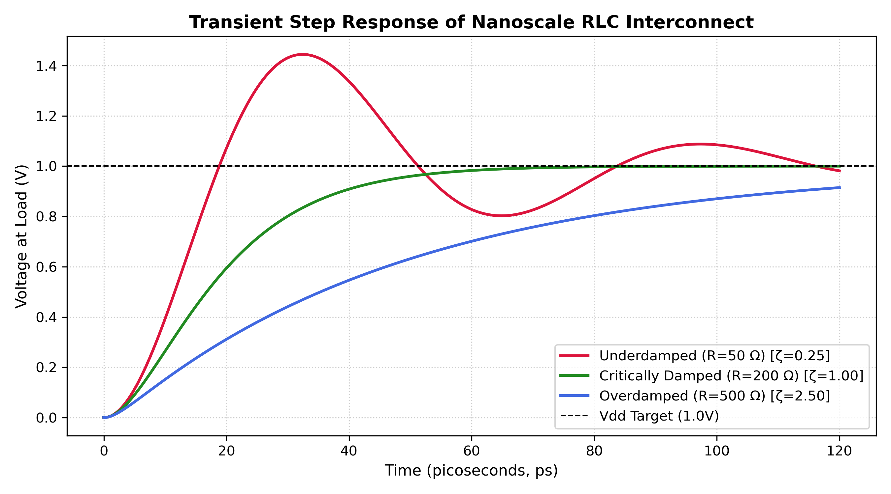

# Simulating RLC Wire Ringing & Delay in Chip Design

### What is this?
When chips run at really high speeds (billions of times per second), long copper wires inside the chip stop acting like normal wires. Rapid electrical changes create wire inductance ($L$) along with resistance ($R$) and capacitance ($C$). 

This script simulates what happens to a voltage signal passing through an RLC wire under three different cases: underdamped, critically damped, and overdamped.

---

### The Math
Using Kirchhoff's Voltage Law across an RLC line:

$$L \frac{d^2 v(t)}{dt^2} + R \frac{dv(t)}{dt} + \frac{1}{C} v(t) = \frac{1}{C} V_{in}$$

How the signal behaves depends on the **damping ratio ($\zeta$)**:

$$\zeta = \frac{R}{2} \sqrt{\frac{C}{L}}$$

* **$\zeta < 1$ (Underdamped):** The signal bounces up and down past the target voltage (ringing).
* **$\zeta = 1$ (Critically Damped):** The signal reaches the target as fast as possible without bouncing.
* **$\zeta > 1$ (Overdamped):** The signal rises slowly without any bouncing.

---

### Simulation Results

Setup: $L = 1.0\text{ nH}$, $C = 100\text{ fF}$, Input Voltage = $1.0\text{ V}$.

| Wire Resistance ($R$) | Damping ($\zeta$) | Max Voltage | Overshoot | Rise Time (10% to 90%) |
|---|---|---|---|---|
| **$50\ \Omega$** (Underdamped) | 0.25 | 1.44 V | **44.4%** | 12.6 ps |
| **$200\ \Omega$** (Critically Damped) | 1.00 | 1.00 V | **0%** | 33.6 ps |
| **$500\ \Omega$** (Overdamped) | 2.50 | 0.91 V | **0%** | 105.4 ps |

---

### What the Numbers Mean

1. **Why low resistance causes problems ($50\ \Omega$):**
   * Even though it rises super fast (12.6 ps), the voltage shoots up to **1.44 V** on a 1.0 V wire.
   * That extra voltage can break or degrade the tiny, thin gates of modern transistors, and the bouncing can cause the chip to read a 0 as a 1 by mistake.

2. **Why high resistance is too slow ($500\ \Omega$):**
   * It stops all bouncing, but the signal takes **105.4 ps** to rise. That is over 8 times slower.
   * If your chip runs at 5 GHz, one full clock tick is only 200 ps. Spending more than half of that just waiting for the wire voltage to charge makes the chip much slower.

3. **The best balance ($200\ \Omega$):**
   * At $200\ \Omega$, the wire is critically damped. It settles cleanly at 1.0 V in 33.6 ps with zero bouncing.

---

### Code
* `simulate_interconnect.py`: Solves the equation and plots the 3 curves.
* `calculate_metrics.py`: Calculates peak voltage, overshoot %, and rise times.
